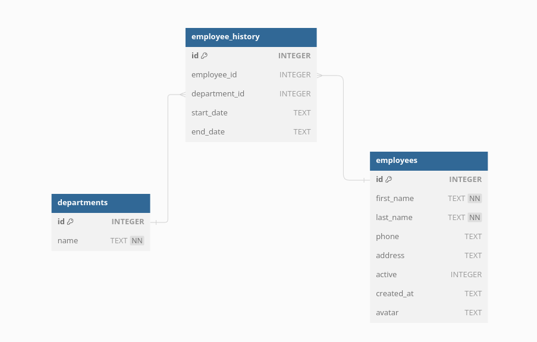

# Employee Management System

This project is an Employee Management System built with the MVC (Model-View-Controller) architecture. The system allows managing employees, their departments, and their history within the organization.

## Table of Contents

- [Project Structure](#project-structure)
- [Database Schema](#database-schema)
- [Setup Instructions](#setup-instructions)
- [Database Diagram](#database-diagram)

## Project Structure

The project follows the MVC architecture, which separates the application logic into three interconnected components: Models, Views, and Controllers. Below is an overview of the project structure:

```
├── config
│ ├── database.js
│ └── seed.sql
├── controllers
│ ├── EmployeeController.js
│ └── DepartmentController.js
├── middlewares
│ ├── cors.js
│ └── upload.js
├── models
│ ├── Department.js
│ └── Employee.js
├── routes
│ ├── departmentRoutes.js
│ └── employeeRoutes.js
├── schemas
│ └── employees.js
├── uploads
└── README.md
└── env.example
└── testApi.http
└── package.json
└── server.js
└── app.js
```

### Controllers

Controllers handle the user input and interaction. They process incoming requests, handle user input, interact with models, and return the appropriate response.

- **EmployeeController.js**: Manages employee-related actions.
- **DepartmentController.js**: Manages department-related actions.

### Models

Models represent the data structure. They define the database schema and provide methods to interact with the data.

- **Employee.js**: Represents the employee data.
- **Department.js**: Represents the department data.

### Routes

Routes define the endpoints and HTTP methods for the application. They map the incoming requests to the appropriate controller actions.

- **employeeRoutes.js**: Routes for employee-related actions.
- **departmentRoutes.js**: Routes for department-related actions.

### Middlewares

Middlewares are functions that execute during the request-response cycle. They can modify the request and response objects, end the request-response cycle, and call the next middleware in the stack.

- **cors.js**: Handles authentication.
- **upload.js**: Handles errors.

## Database Schema

The database schema is defined in the `seed.sql` file located in the `config` directory.

- **Path**: `config/seed.sql`

### Tables

- **employees**: Stores employee information.
- **departments**: Stores department information.
- **employee_history**: Stores employee department history.

## Setup Instructions

1. **Clone the repository**:

   ```bash
   git clone https://git.number8.com/ericson.hernandez/fullstack-assessment-backend.git
   ```

2. **Navigate to the project directory**:

   ```bash
   cd fullstack-assessment-backend
   ```

3. **Install dependencies**:

   ```bash
   npm install
   ```

4. **Set up the database**:

   - Create the database using Turso https://docs.turso.tech/sdk/ts/quickstart
   - and run the SQL script to create the database schema:

   ```bash
   sqlite3 yourdatabase.db < config/seed.sql
   ```

5. **Configure the environment variables**:

   - Create a `.env` file in the root directory of the project and add your Turso configuration:

   ```
   TURSO_DB_TOKEN=your_turso_db_token
   TURSO_DATABASE_URL=your_turso_database_url
   ```

   - If you don't have a configuration, you can use the `.env.example` file as a template:

   ```bash
   cp .env.example .env
   ```

6. **Start the application**:

   ```bash
   npm start
   ```

## Database Diagram

Below is a diagram of the database schema:


